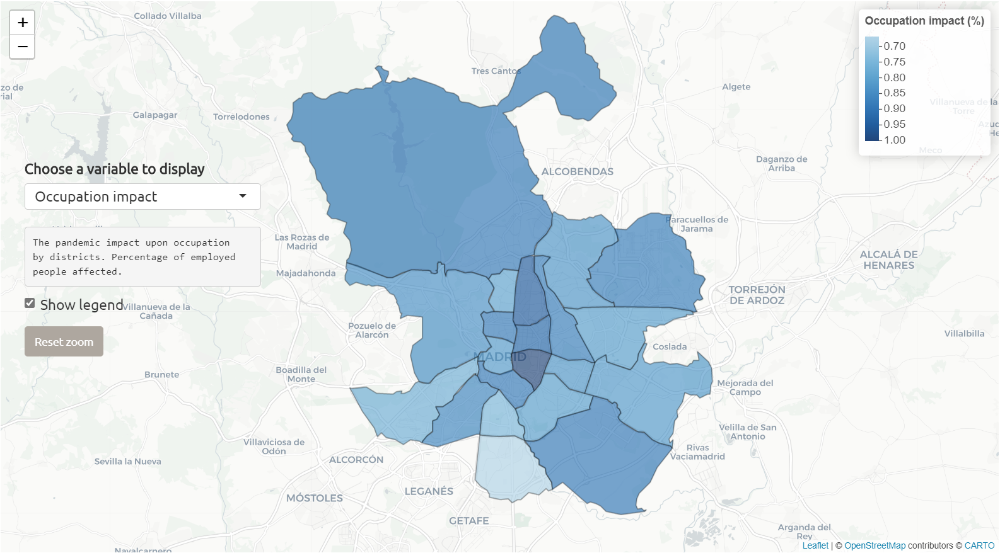

# Madrid-COVID19

This is a simple web application deployed through RStudio's *Shiny* apps, designed to show the impact of confinement on socioeconomic aspects of the population of Madrid, the capital of Spain. The application can be accessed via the following [link](https://gonzalorh.shinyapps.io/Madrid_COVID19/) (sorry if it is down...). 

The data for this study comes from a survey carried out by the Madrid City Council and accessible through its [portal](https://datos.madrid.es/portal/site/egob/menuitem.c05c1f754a33a9fbe4b2e4b284f1a5a0/?vgnextoid=79c6ec6846c22710VgnVCM2000001f4a900aRCRD&vgnextchannel=374512b9ace9f310VgnVCM100000171f5a0aRCRD&vgnextfmt=default
). 

The inspiration for this project came from an assignment for a Data Visualization course in my Master's program.

Hope you like it!

## Files description

- *Load_prepare_data.R*. R script that preprocess the raw data from the surveys (*encuesta_covid19_hogar_informante_2020.xlsx* and *encuesta_covid19_miembros_2020.xlsx*) for further use. Data that is not present in either excel files is given already preprocessed in the *Data_laboral.csv* and *Dataset_prepocess.csv* files.

- *DISTRITOS*. This folder contains the Madrid districts shapefiles required to build the maps.

- *app.R*. R script that renders the Shiny app.
